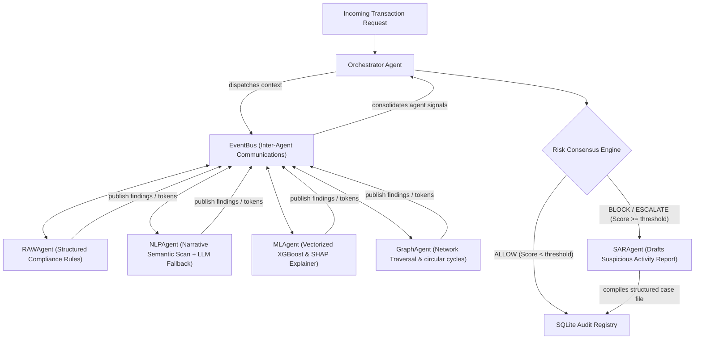
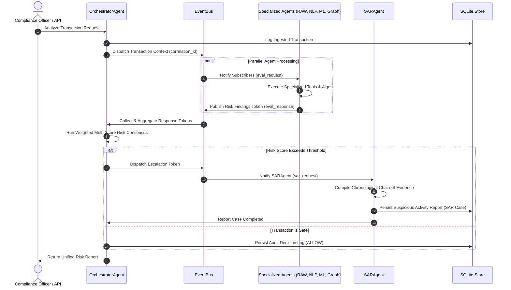

# 🛡️ crypt.ml — Autonomous Multi-Agent AML & CFT Platform

[](https://fastapi.tiangolo.com/)
[](https://react.dev/)
[](https://www.sqlite.org/)
[](https://vitejs.dev/)
[](https://www.python.org/)
[](https://www.docker.com/)
[](https://render.com/)
[](https://vercel.com/)

crypt.ml is a production-ready, local-first **Autonomous Multi-Agent Anti-Money Laundering (AML)** and Counter-Financing of Terrorism (CFT) platform. Built to move beyond rigid, legacy rule-based triggers, crypt.ml implements an event-driven cooperative network of specialized AI agents, real-time transaction network graphs, predictive machine learning (XGBoost + local SHAP explanation features), and interactive compliance tools inside a premium, glassmorphic dark-mode dashboard.

---

## 🎨 System Showcase & Visual Preview

### High-Fidelity Management Dashboard


---

## 🏗️ Multi-Agent Event-Driven Architecture

At the core of crypt.ml is a cooperative, event-driven multi-agent framework orchestrated via an asynchronous, central `EventBus`. Instead of evaluating transactions in isolation, five specialized agents coordinate in parallel to exchange findings, invoke dedicated tooling, publish analysis tokens, and reach an objective risk consensus.

### Agentic Pipeline Flow



### Sequence Flow of a Verification Pipeline



---

## 🤖 Meet the Autonomous Agents

Every agent in the crypt.ml platform inherits from a standardized `BaseAgent` structure, equipped with a dedicated `ToolRegistry` for execution, localized `AgentMemory` for observation histories, and asynchronous pub-sub capabilities.

| Agent Name | Primary Responsibility | Algorithms & Tooling | Fallback Strategy |
| :--- | :--- | :--- | :--- |
| **OrchestratorAgent** | Coordinates pipeline execution, handles state sync, performs weighted consensus aggregation, and decides final case escalations. | Weighted consensus matrices, correlation-tracking matrices. | Fallback to safe structural defaults if key agents encounter timeouts. |
| **RAWAgent** | Evaluates transactions against active compliance threshold rules, checking speed frequency, sanction match, and volume. | Multi-rule matching, dynamic rule registries. | Evaluates static local default profiles in case of DB rule failures. |
| **NLPAgent** | Analyzes transaction textual memos or narratives for money laundering indicators (e.g. structuring, smurfing, shell co). | 50+ Term multi-category financial risk lexicon. | Falls back seamlessly to Local LLM (Ollama) or regex matches. |
| **MLAgent** | Classifies structured transactions using machine learning, explaining model predictions using Shapley additive values. | In-process XGBoost classifier + SHAP local contribution vectors. | Mockup risk model with randomized normal weight variations if models aren't trained. |
| **GraphAgent** | Builds real-time transactional interaction subgraphs to scan for laundering network topology issues. | NetworkX graphs, Louvain modularity clustering, cycle loop traversal. | Fallback to bipartite degree metrics if subgraphs are disconnected. |
| **SARAgent** | Automatically drafts structured, legally-compliant Suspicious Activity Reports (SAR) for flagged items. | Automated markdown templating, structural evidence compilation. | Strict generic structured summary logs. |

---

## 💬 Sample Inter-Agent Message Payload

Below is an authentic JSON event token captured from the central event registry during analysis. Notice the unique UUID `correlation_id` which acts as the thread connecting the multi-agent consensus trail:

```json
{
  "id": "7820adfb-761e-450f-a9cb-f14d89047b85",
  "sender": "MLAgent",
  "receiver": "OrchestratorAgent",
  "msg_type": "response",
  "payload": {
    "score": 82.4,
    "confidence": 0.94,
    "decision": "BLOCK",
    "reasoning": "High-risk XGBoost probability detected. Top features: amount_to_income_ratio (contrib: +0.42), transaction_frequency_1h (contrib: +0.28).",
    "evidence": [
      {
        "feature": "amount_to_income_ratio",
        "value": 12.8,
        "shap_contribution": 0.42
      }
    ]
  },
  "timestamp": "2026-05-22T14:15:30.402Z",
  "correlation_id": "c880a1d4-8973-4214-9986-cd9ba233b2ea"
}
```

---

## 🎨 Premium Glassmorphic Design System

The crypt.ml frontend is designed to deliver a modern, premium experience. Operating strictly on **Vanilla CSS** and customized **HSL variable design tokens**, it provides:

* **Sleek HSL Palettes**: Elegant deep space shades matched with neon warnings (`--warning: 38 92% 50%`) and toxic reds (`--danger: 0 84% 60%`).
* **Glassmorphic Backdrops**: Dense background-blurs (`backdrop-filter: blur(16px)`), thin translucent borders, and ambient box shadows to deliver three-dimensional depth.
* **Micro-Animations**: Hover-triggered translations, pulsing active states, and transition timelines matching Framer Motion's cubic-bezier physics.
* **Highly Modular Architecture**: Separated cleanly into pages (`Overview.jsx`, `AgentDashboard.jsx`, `CaseManager.jsx`, `RuleSandbox.jsx`, `ModelStudio.jsx`, `AIAssistant.jsx`) and re-usable layout frames.

---

## ⚡ Core API Reference

The FastAPI service exposes fully validated Pydantic endpoints. When `CRYPT_ML_REQUIRE_API_KEY=true` is set, calls require authentication via the `x-api-key` header.

| Category | HTTP Method | Route | Description | Auth Required |
| :--- | :--- | :--- | :--- | :--- |
| **System** | `GET` | `/api/v1/health` | Verifies core database and system status. | No |
| **Agents** | `POST` | `/api/v1/agents/analyze` | Initiates the event-driven multi-agent consensus pipeline. | Optional |
| **Agents** | `GET` | `/api/v1/agents/decisions` | Retrieves audited historical decisions and consensus stats. | Optional |
| **Agents** | `GET` | `/api/v1/agents/cases` | Lists cases escalated to SAR reports for manual review. | Optional |
| **ML Engine** | `GET` | `/api/v1/ml/info` | Returns metrics of active model states and global SHAP weights. | Optional |
| **ML Engine** | `POST` | `/api/v1/generate-data/save` | Generates a new CSV data batch and registers it to disk. | Optional |
| **Rules Engine**| `GET` | `/api/v1/session-rules` | Retrieves active rule profiles currently evaluated by RAWAgent. | Optional |
| **Rules Engine**| `POST` | `/api/v1/session-rules` | Injects new active threshold rules directly into current session. | Optional |

---

## 💻 Local Onboarding & Setup

Follow these steps to configure your local development environment:

### Prerequisites
Make sure you have installed **Python 3.10+** and **Node.js 18+**.

### 1. Backend FastAPI Server Setup
1. **Initialize and Activate Virtual Environment**:
   ```bash
   # Windows:
   python -m venv .venv
   .venv\Scripts\activate

   # Linux/macOS:
   python3 -m venv .venv
   source .venv/bin/activate
   ```

2. **Install Core Requirements**:
   ```bash
   pip install -r requirements.txt
   ```

3. **Launch the FastAPI Server**:
   ```bash
   python -m uvicorn app.main:app --reload --host 127.0.0.1 --port 8000
   ```
   * *Interactive Swagger Documentation is served at:* `http://127.0.0.1:8000/docs`
   * *The database file is created dynamically at:* `data/crypt_ml.db`

### 2. Frontend React Client Setup
1. **Navigate to the frontend directory**:
   ```bash
   cd frontend
   ```

2. **Install Node Packages**:
   ```bash
   npm install
   ```

3. **Launch Vite Development Server**:
   ```bash
   npm run dev
   ```
   * *Open your browser and navigate to:* `http://localhost:5173/`

---

## 🧪 Comprehensive Verification & QA

Keep code quality and system performance hardened using our standard checks:

```bash
# Execute the complete backend test suite (199/199 green tests passing)
.venv\Scripts\python.exe -m pytest

# Run automated lint formatting checks
.venv\Scripts\python.exe -m flake8 app/ tests/

# Verify the frontend production-ready Vite compiler
cd frontend
npm run build
```

---

## 🐳 Docker Containerization

To package the entire backend system into a production-ready image, use the standard multi-stage Docker builder:

```bash
# Build the image locally
docker build -t crypt.ml-backend .

# Run the container mapping FastAPI port 8000
docker run -d -p 8000:8000 -v $(pwd)/data:/app/data crypt.ml-backend
```

---

## 🚀 One-Click Cloud Deployments

crypt.ml is configured for effortless cloud hosting with persistent storage and optimized SPA routing.

### Backend (Render Cloud Platform)
crypt.ml has a ready-made `render.yaml` Blueprint definition:
1. Navigate to your **Render Dashboard** and select **New → Blueprint**.
2. Connect your cloned GitHub repository.
3. Render automatically maps:
   * A **Python FastAPI Web Service** built via `Dockerfile`.
   * A **1 GB Persistent Disk Volume** mounted at `/app/data` ensuring your `crypt_ml.db` remains safe across dyno restarts.
4. Click **Deploy**.

### Frontend (Vercel Global Edge)
crypt.ml has pre-configured Vercel configurations (`vercel.json`) to redirect routes to `index.html` for clean React Router SPA pathing:
1. Navigate to **Vercel Console** and import the repository.
2. Select the `frontend` folder as the root directory.
3. Under **Environment Variables**, add:
   * **Key**: `VITE_API_BASE_URL`
   * **Value**: Your Render Backend Service URL (e.g. `https://crypt.ml-backend.onrender.com`).
4. Click **Deploy**.
